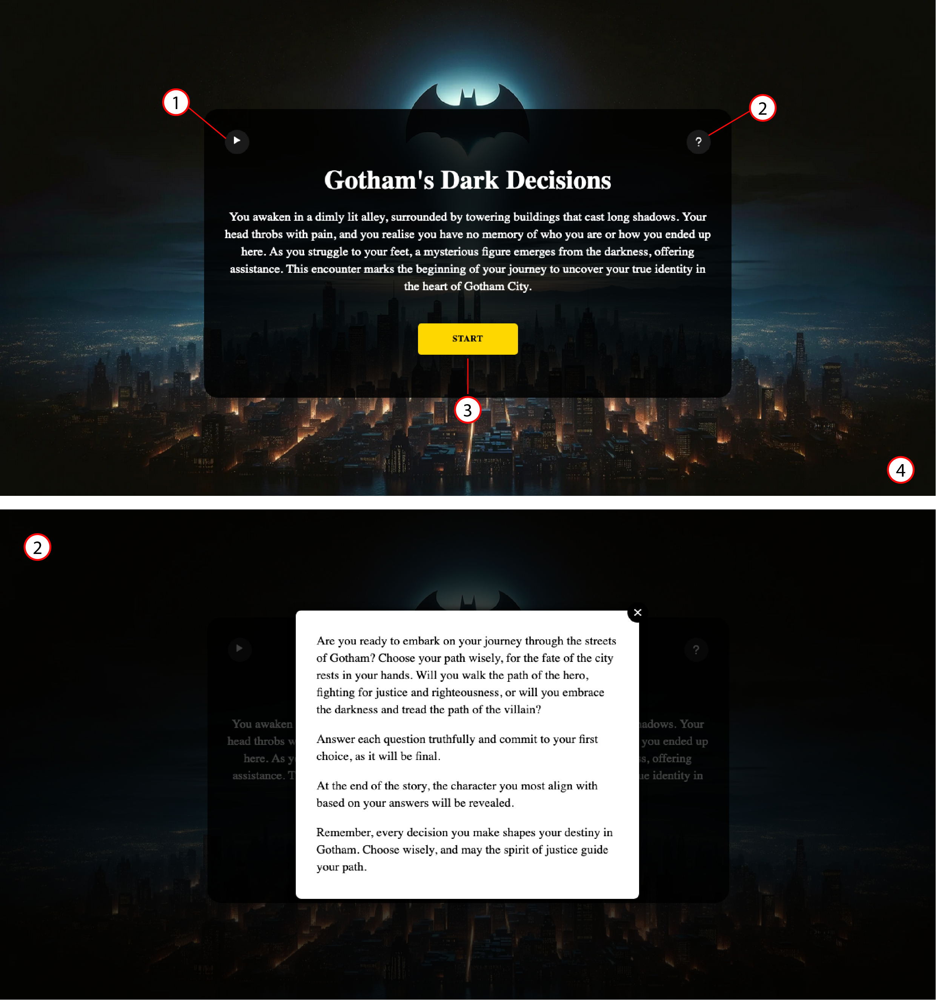

# GOTHAM'S DARK DECISIONS

# TABLE OF CONTENTS

- [Gotham's Dark Decisions](#gothams-dark-decisions)
- [TABLE OF CONTENTS](#table-of-contents)
- [INTRODUCTION](#introduction)
  - [Overall Website Aim](#overall-website-aim)
  - [External User Goals](#external-user-goals)
  - [Website Owners Goals](#website-owners-goals)
  - [User Story](#user-story)
- [DESIGN](#design)
  - [Wireframes](#wireframes)
  - [Imagery](#imagery)
  - [Colours](#colours)
  - [Fonts](#fonts)
  - [Accessibility](#accessibility)
  - [Design Feedback](#design-feedback)
- [FEATURES](#features)
  - [Existing Features](#existing-features)
    - [**Navigation:**](#navigation)
    - [**Hero Images:**](#hero-images)
    - [**Landing Page:**](#landing-page)
    - [**Cake of the Month Page:**](#cake-of-the-month-page)
    - [**Baking Tips Page**](#baking-tips-page)
    - [**Sign Up**](#sign-up)
    - [**Footer**](#footer)
    - [**404 Error Page**](#404-error-page)
  - [Future Website Enhancements](#future-website-enhancements)
- [BUGS](#bugs)
  - [Fixed Bugs](#fixed-bugs)
    - [Hero Image Rendering Issue on Mobile Devices](#hero-image-rendering-issue-on-mobile-devices)
    - [Navigation Bar Overlaps Section Headings](#navigation-bar-overlaps-section-headings)
    - [Sign-Up Button Not Visible on Small devices in Landscape Orientation](#sign-up-button-not-visible-on-small-devices-in-landscape-orientation)
  - [Known Bugs (unresolved)](#known-bugs-unresolved)
    - [Hover State Reset After Modal Closure](#hover-state-reset-after-modal-closure)
- [TECHNOLOGY](#technology)
  - [Languages Used:](#languages-used)
  - [Frameworks, Libraries and Programs Used](#frameworks-libraries-and-programs-used)
- [TESTING](#testing)
  - [Manual Testing](#manual-testing)
    - [Feature testing:](#feature-testing)
    - [Browser Compatibility:](#browser-compatibility)
    - [Responsiveness Test:](#responsiveness-test)
  - [Validator Testing](#validator-testing)
    - [HTML](#html)
    - [CSS](#css)
    - [Light House Analysis](#light-house-analysis)
- [DEPLOYMENT](#deployment)
- [CREDITS](#credits)
  - [Content](#content)
  - [Images](#images)
  - [Resources](#resources)
  - [Acknowledgements](#acknowledgements)

# INTRODUCTION
Welcome to Gotham's Dark Decisions - the interactive frontend website that plunges you into the captivating world of Batman. In this immersive experience, users will embark on a thrilling journey of self-discovery, exploring their inner hero, or villain, through a series of thought-provoking questions.

Gotham's Dark Decisions is more than just a personality quiz - it's a portal to the heart of Gotham City, where shadows reign and the line between good and evil is constantly blurred. Inspired by the rich lore of Batman, this project invites users to explore their own identity within the context of Gotham's complex universe.

To get started with Gotham's Dark Decisions, simply visit the website and click on the "START" button. From there, follow the prompts to navigate through the quiz and discover your fate within the Batman universe.

Visit Gotham's Dark Decisions website here [Gothams Dark Decisions](https://enrightc.github.io/Gothams-Dark-Decisions/)

## Experience
  - Choose Your Path: Begin your journey by deciding whether you'll walk the path of a hero or embrace the allure of the darkness as a villain.
  - Interactive Quiz: Answer a series of questions designed to reveal your true nature and uncover your place within the Batman universe.
  - Bat family or Villain: Based on your choices, discover which member of the Bat family you most closely resemble, or which infamous Batman villain shares your traits.
  - Engaging Experience: Immerse yourself in the dark and atmospheric world of Gotham City, brought to life through intriguing questions and stunning visuals.
  
## Project Rationale
The purpose of the "Gotham's Dark Decisions" project is to create an immersive front-end interactive site that responds dynamically to users' actions, offering them a unique experience within the Batman universe.

Traditionally, personality quizzes can feel static and detached. "Gotham's Dark Decisions" seeks to redefine this experience by offering an interactive journey for players. Through a series of thought-provoking questions, players actively shape their own narrative within the Batman universe.

Unlike conventional quizzes, where results are predetermined, Gotham's Dark Decisions  dynamically adapts to users' responses, allowing them to uncover which Batman character's personality traits resonate most with their own. Each player's result reflects their unique characteristics and choices.

To further immerse players in the world of Gotham City, the quiz incorporates elements reminiscent of reading a Batman graphic novel. Chapters guide players through the narrative, while transition effects mimic the experience of turning pages. Additionally, changing backgrounds enhance the atmosphere, captivating players and drawing them deeper into the world of Batman.

The ultimate goal of "Gotham's Dark Decisions" is to captivate players and provide them with an unforgettable experience that resonates with fans of the Dark Knight. By combining interactive elements, storytelling techniques, and engaging visuals, the quiz aims to leave a lasting impression and foster a deeper connection with the iconic characters of Gotham.

## Overall Website Aim
Gotham's Dark Decisions aims to truly immerse users in the captivating world of Batman, providing an interactive platform that responds dynamically, allowing users to exploring their own heroic or villainous nature. Through engaging and thought-provoking questions, users will embark on a journey of self-discovery within the rich and atmospheric backdrop of Gotham City. The primary goal is to entertain and engage Batman enthusiasts, offering them a unique and immersive experience that celebrates the iconic characters and themes of the Batman universe. Additionally, it aims to provide users with valuable insights into their own personalities and the complex dynamics of heroism and villainy, all while fostering a sense of excitement and intrigue through engagment. Whether users are long time fans or newcomers to the world of Batman, Gotham's Dark Decisions invites them to explore, discover, and embrace their inner hero or villain.

## External User Goals
  - Take part in a quiz that responds dynamically to user input.
  - Explore Heroic or Villainous Paths: Users are eager to explore their heroic or villainous tendencies through engaging questions and scenarios.
  - Discover Bat family or Villain Identity: Users aim to uncover which member of the Bat family they resemble or which notorious Batman villain shares their traits.
  - Experience the Atmosphere of Gotham: Users seek to immerse themselves in the dark and atmospheric world of Gotham City, enjoying thought-provoking questions and stunning visuals.
  - Engage with the Batman Universe: Users are excited to engage with the iconic characters and themes of the Batman universe.

## Website Owners Goals
  - Build User Engagement: Create a highly engaging and interactive experience for users, encouraging them to spend more time on the website and try out different paths of the quiz.
  - Establish Brand Authority: The site owner aims to position the website as a leading authority on Batman-related personality quizzes, attracting fans and enthusiasts seeking entertainment and insights into the iconic characters and themes.

## Target Audience
  - Fans of the Batman franchise.
  - People who enjoy reading graphic novels.
  - Personality quiz enthusiasts.

## User Story
- As a first-time user
  - I want to be able to start the quiz by clicking on a "Begin Quiz" button.
  - I want to be presented with a question asking if I prefer to be a hero or a villain in the Batman universe.
  - If I choose "hero," I want to be presented with questions that help determine which member of the Batfamily I am most like.
  - If I choose "villain," I want to be presented with questions that help determine which Batman villain I am most like.
  - I want each question to be presented one at a time, with clear instructions on how to proceed to the next question.
  - I want to be able to select my answer from multiple choice options.
  - I want to see my progress through the quiz, such as how many questions I have answered and how many are remaining.
  - I want to receive my results at the end of the quiz, telling me which member of the Bat-family or which Batman villain I am most like.
  - I want the quiz to be visually appealing and in line with the Batman theme through the use of images, colours, and fonts.
- As a returning user
  - I want to have the option to retake the quiz if I want to try different answers.

# LOGIC OVERVIEW
The Gotham's Dark Decision quiz is a JavaScript-powered frontend website designed to immerse users in the captivating world of Batman. However, to ensure accessibility and comprehension for a broader audience, the code has been translated into plain English. This transparency provides users with insight into the application's functionality and structure without requiring programming knowledge, fostering trust and engagement.

1. Fade In Transition: When the document is ready, the main content fades in gradually over 2.5 seconds using jQuery.

2. Essential Elements:
   - Key elements such as answer buttons, character scores, and current question indexes are initialized.
   - Initial scores for Batman, Robin, Red Hood, Batgirl, The Joker, The Penguin, Bane, and Catwoman are set to 0.
   - Variables for current hero and villain question indexes, user character, and personality are declared.

3. Start Game Function: Clicking the start button initiates the game by hiding the start button and intro, displaying the game container, and showing the first question.

4. showFirstQuestion Function: Responsible for displaying the first quiz question, allowing users to choose between hero or villain paths.
    - Sets the text of question title and box elements to match the first question.
    - Creates answer buttons for each option, associating personality data with each button.
    - Attaches event listeners to handle user responses, initiating either the hero or villain path.

5. Start Hero/Villain Path Functions: Initiates the hero or villain path based on the user's choice.

6. Next Hero/Villain Question Functions: Displays subsequent hero or villain questions, updates scores based on user answers, and progresses through the quiz.
    - Retrieves the next question object and sets question text elements accordingly. 
    - Clears previous answer buttons and displays new answer options.
    - Handles user responses, incrementing corresponding character scores and advancing to the next question or displaying the revelation if no more questions. 

7. Revelation Function: Shows the revelation container for either a hero or villain.
    - Hides the game container and reveals the revelation container.
    - Displays specific content based on whether the user's personality is hero or villain.
    - Calls the score function to determine the user's character. 
   
8. Score Function: Calculates the user's character based on the highest score and assigns the corresponding character name.
    - Determines the maximum score among character variables and assigns the corresponding character name to the user.

9. Character Reveal:
    - Event handler calls the displayResult function when reveal button is clicked.
    - DisplayResult function hides the revelation container and reveals the results container.
    - It determines the user's character based on the userCharacter variable and displays the appropriate heading, character description, and picture in the results container.
      - It appends a heading indicating the character's name (You Are [Character]).
      - It appends a paragraph with a description of the character's traits, motivations, and role in Gotham.
      - It sets the src attribute of an  element to display the character's headshot.

10. Game Reset:
    - Causes the game to reset by reloading the browser in the same way the refresh button on your browser reloads the page. 

11. Voiceover Function: Toggles the play/pause button for an audio voiceover.

12. Questions: Define arrays containing hero and villain questions, each with titles, questions, and multiple-choice answers, tailored to each character's path. The showFirstQuestion 
    function directs users down either the hero or villain path based on their initial response.
    - If the user's answer leads to the hero path, subsequent questions are drawn from the heroQuestions array.
    - Conversely, if the user's answer leads to the villain path, questions are drawn from the villainQuestions array.
      

# DESIGN

## Wireframes
Prior to commencing the coding process, comprehensive wireframes were produced for each section of the quiz  using Figma - a design tool used for creating user interfaces, prototypes, and wireframes. These wireframes served as the initial blueprints, providing a visual roadmap for the quiz layout and structure on both desktop and mobile devices.

It's important to note that while the final product evolved from these early plans, some deviations were intentionally made to enhance the user experience and align better with the project's goals.

This iterative process allowed for flexibility in adapting to evolving project requirements, ultimately contributing to the development of a more refined and user-friendly quiz.

[Introduction (Desktop)](docs/readme-images/wireframe-desktop-intro.png)
[Introduction (Mobile)](docs/readme-images/wireframe-mobile-intro.png)
[Questions (Desktop)](docs/readme-images/wireframe-questions-desktop.png)
[Questions (Mobile)](docs/readme-images/wireframe-questions-mobile.png)
[Results (Desktop)](docs/readme-images/wireframe-results-desktop.png)
[results (Mobile)](docs/readme-images/wireframe-results-mobile.png)

## Imagery
The imagery chosen for this quiz is purposeful and aims to enhance the overall user experience. Each background image used throughout the quiz has been carefully selected to complement the theme and narrative of the quiz.

As the user progresses through the quiz, the background imagery dynamically changes with a fadeIn/fadeOut transition effect. This deliberate design choice aims to immerse the user in the experience, creating a sense of progression akin to turning the pages of a graphical novel.

The changing background imagery not only adds visual interest but also helps to convey the evolving storyline and atmosphere of the quiz. By seamlessly integrating visual elements with the quiz content, the goal is to enhance user engagement and create a memorable and immersive experience for every participant.

## Colours
The colour scheme used in this quiz is purposefully minimalistic, aiming to evoke the dark and gritty ambiance of Gotham City. Drawing inspiration from the iconic setting, the colour palette revolves around bold and striking hues, accentuated by hover effects to highlight key elements of the page.

At the outset of the quiz, a vibrant yellow colour takes center stage in the the interface, setting the stage for the user's journey. As the quiz progresses, the colour dynamically shifts to either red or blue, reflecting the path chosen by the user – hero or villain, respectively. This intentional use of colour not only enhances the visual narrative but also provides a subtle indication of the user's progress and choices throughout the quiz.

Consistency is maintained in the choice of font colours, with a white font against dark-coloured backgrounds ensuring optimal readability and visual contrast. By employing a minimalist colour scheme and hover effects, the goal is to immerse participants in the immersive world of the quiz while maintaining clarity and ease of navigation.

## Fonts
In this quiz project, typography plays a crucial role in enhancing visual appeal and ensuring readability across all content. Consistently, the 'Judson' font is employed for both headings and paragraph text, offering a balanced and cohesive aesthetic throughout the interface.

For headings, 'Judson' imparts a sense of elegance and sophistication, elevating the presentation of key information. Meanwhile, paragraph text is set in 'Judson' as well, ensuring a comfortable reading experience for users across all sections.

To maintain consistency and legibility, a Sans Serif font serves as the backup option. This ensures that even if the primary font isn't loaded correctly, the text remains clear and easily readable.

This consistency provides a seamless and visually pleasing experience for users.

## Accessibility
Accessibility is a key consideration in the design of this quiz project, ensuring that all users, regardless of ability, can fully engage with the content.

Colour Contrast: The chosen colour scheme offers a strong contrast, enhancing readability and ensuring that text and content are easily distinguishable against the background. This deliberate choice promotes a visually accessible experience for all users.

Font Selection: Prioritizing simplicity and readability, clear and straightforward fonts have been selected. This ensures that the content remains legible for users with varying visual abilities, contributing to an inclusive user experience.

Background Images: Background images are purely decorative and serve no functional purpose within the quiz. Removing them would not affect the meaning or functionality of the quiz, thus maintaining accessibility for all users.

Icons: Icons are used as links to relevant information or interactive elements within the quiz. To ensure accessibility, each icon is accompanied by an aria-label attribute providing additional information for users employing screen readers. This facilitates seamless navigation and interaction for all users, promoting inclusivity throughout the quiz experience.

## Design Feedback
The Gotham's Dark Decisions quiz  has undergone thoughtful design reviews from friends and colleagues. below is some of the feedback received:

- **User-Friendly Design:** Reviewers have praised the user-friendly design of the quiz, noting its intuitive layout and easy navigation. This ensures that users can progress through the quiz seamlessly, enhancing their overall experience.

- **Immersive Experience:** Users have expressed appreciation for the immersive experience provided by the background imagery transitions. The fadeIn/fadeOut effect adds depth to the storytelling aspect of the quiz, making users feel as though they are journeying through a graphic novel.

- **Engaging Visuals:** The deliberate use of minimal colors to evoke the dark ambiance of Gotham City has resonated well with users. Additionally, the dynamic color changes of the buttons based on the user's path choice add an engaging and interactive element to the quiz interface.

- **Clear Instructions:** Reviewers have commended the clear and concise instructions provided throughout the quiz. This clarity helps users understand the purpose of each question and navigate through the quiz with ease.

- **Interactive Elements:** Users have enjoyed the interactive elements incorporated into the quiz, such as the hover effects over buttons. These features enhance user engagement and make the quiz experience more dynamic and enjoyable.

- **Engaging Audio Narration:** Users appreciate the immersive audio narration at the quiz's start. It sets the tone, enhancing the storytelling and leaving a memorable impact.

# Game Functionality and Structure
The quiz is designed to be engaging and interactive, comprising eight questions that lead the user on a journey through the Batman universe.

**Question Structure:** The quiz consists of eight questions, each with four answer options for the user to choose from. The first question serves as a pivotal point, with two possible answers determining whether the user takes the hero or villain path. Subsequent questions (2 - 8) each have four answer options tailored to align with either heroes (Batman, Robin, Red Hood, and Batgirl) or villains (The Joker, Penguin, Bane, and Catwoman), depending on the chosen path.

**Character Alignment:** With each answer selected, the quiz builds a profile of the character the user most aligns with. This process culminates in presenting the user with their character alignment at the end of the quiz.

**Section Layout:** The quiz is contained within a single page structured into four sections: Introduction, Questions, Revelation, and Reveal. As the user progresses through the quiz, smooth transitions seamlessly guide them from one section to the next.

# FEATURES
## Existing Features
The following information provides an overview of the features found within the quiz.

**Landing Page**
Designed with a deliberate focus on simplicity, the landing page boasts a striking H1 heading introducing the game as "Gotham's Dark Decisions" accompanied by introductory text that sets the stage for the immersive experience ahead. 

Section Elements:
1. Audio Button: Elevating immersion, this feature offers synchronised voice-over narration, enriching the atmosphere and deepening engagement as users navigate the text.

2. Help Button: Providing accessible support, the dedicated help button ensures users can easily seek assistance or guidance, fostering a user-friendly experience suitable for all levels of quiz familiarity.

3. Start Button: Positioned prominently, the start button beckons users to embark on their quiz adventure, seamlessly guiding them into the captivating world of Gotham and its legendary characters.

4. Background Image: Setting a captivating scene, the background showcases the iconic Gotham cityscape illuminated by the iconic bat signal, captivating users from the moment they arrive on the page.

**The Choice:**
A pivotal moment of the quiz, the first question provides the user with a choice that will determine if they take the path of a hero or villain for the rest of the game. 

Section Elements:
5. Title: Each question is accompanied by a title to provide context.

6. Question: This section acts as a placeholder for the initial question, setting the stage for the user's pivotal choice.

7. Answers: Question one presents the user with a binary decision, offering only two possible answers. This choice determines whether the user embarks on the hero's or villains path.

8.  Progression: A progress bar is included to indicate the user's advancement through the quiz, providing visual feedback on their progress.

**The Questions**
Both the hero and villain paths consist of seven questions each, providing users with a distinct narrative journey based on their initial choice.

Section Elements:

9. Title: Each question is introduced with a title, offering essential context to guide users through their decision-making process.

10. Question: From questions two to eight, the quiz delves deeper into the user's chosen path, whether heroic or villainous.

11. Answers: Users are presented with four multiple-choice answers for each question. Answers along the hero's path are highlighted in a soothing blue color scheme, while those along the villain's path are accentuated with a striking red. Additionally, Additionally, each answer includes a data attribute that identifies the character it aligns with, though this attribute is not visible to the user.

12. Progress bar: A progress bar is included to indicate the user's advancement through the quiz, providing visual feedback on their progress.

13. Background: As users progress through the quiz, the background imagery undergoes dynamic changes, enhancing immersion and complementing the evolving narrative. This subtle yet impactful feature elevates the overall user experience, fostering deeper engagement with the quiz environment.

**The Revelation:**
Upon completing all questions, users are directed to a concluding narrative page that brings closure to their journey through the quiz. This page serves as the culmination of their decisions and actions.

Section Elements: 

14. Click to Reveal: This button invites users to uncover the character from the Batman universe with whom they most closely align based on their quiz responses. It encourages users to stay engaged and provides a fun and rewarding way to cap off their quiz experience.

**Character Reveal:**
This final section reveals the character the user most closely aligns with.

Section Elements:
15. Character: This is the character the user aligns with.

16. Character Bio: A short description of the character.

17. Character Image: a picture of the character.

18. Refresh Button: Clicking this button will take the user back to the start page so they can take a different path. 

## Future Enhancements
**Dynamic Quiz Expansion:** One of the key areas for improvement in the project is to enhance the dynamic nature of the quiz. This can be achieved by adding more questions that introduce additional branching paths based on user responses. By diversifying the progression routes, the quiz becomes more engaging and offers a higher level of repeatability, as users can explore different outcomes with each playthrough.

**Visual and Audio Enhancements:** Adding visual and audio enhancements could elevate the overall user experience of the quiz. This may include integrating more immersive background visuals, sound effects, or music tracks that align with the mood and theme of the Batman universe. Additionally, incorporating animations or visual cues during transitions can further enhance the storytelling aspect of the quiz.

**Accessibility and Usability Features:** Implementing accessibility and usability features can make the quiz more inclusive and user-friendly. This may involve optimising the quiz interface for screen readers, ensuring compatibility with assistive technologies, and incorporating features such as keyboard navigation and adjustable font sizes to accommodate users with additional needs.

**Refactoring Code:** Instead of having three separate arrays for questions, they could be consolidated into a single array of objects. Each object can represent a question, containing properties such as the question itself, answer options, and other relevant data. When the user makes a choice, it can filter this array to display the appropriate questions based on their path (hero or villain).

# BUGS

## Fixed Bugs
### Title: Incorrect Access of Answer Personality Types

#### Issue:
When clicking on an answer button in the first question of the quiz, both hero and villain personality types are being accessed, resulting in incorrect behaviour and progression through the quiz.

#### Description:
During testing of the quiz functionality, it was observed that clicking on an answer button in the first question did not accurately reflect the selected personality type (Hero or villain). Instead of distinguishing between hero and villain personalities, both types were being accessed simultaneously.

#### Expected Behavior:
When clicking on an answer button, only the corresponding personality type (hero or villain) should be accessed and used to determine the next steps in the quiz. This ensures that the quiz accurately reflects the user's choices and progresses accordingly.

#### Steps to Reproduce:
1. Access the quiz application.
2. Start the quiz.
3. Click on an answer button for a question that presents hero or villain personality options.
4. Note that both hero and villain paths are triggered simultaneously.

#### Investigation and Solution:
1. Reviewed the `showFirstQuestion` function responsible for displaying the hero or villain branch question of the quiz quiz.
2. Added jQuery's .data() method to attach the data property "personality" from the array to the button element. 
3. Addeed '$(this).data("personality") to the event listenter  to retreive the value property "personality" from the specfic button element that was clicked and store it in the personality variable to be used in the if/else statement.
4. Tested the modified code using console.log toto verify that only the correct personality type is accessed, resolving the issue of incorrect quiz progression.

#### Result:
The bug related to the incorrect access of answer personality types has been fixed. Now, when clicking an answer button in the first question, only the corresponding hero or villain personality type is accessed, ensuring accurate quiz progression based on user choices.

### Title: Hover Effect Persisting on Mobile Devices

#### Issue:
Hover effect on answer buttons persists on mobile devices, leading to an inconsistent user experience.

#### Description:
During testing of the quiz application on mobile devices, it was observed that after selecting an answer and progressing to the next question, the last selected answer button maintained its hover appearance. This behavior was inconsistent with the expected behavior and caused confusion among users.

#### Expected Behavior:
On mobile devices, the hover effect should not persist after an answer button is selected and the user progresses to the next question. This ensures a consistent and intuitive user experience across different devices.

#### Steps to Reproduce:
1. Access the quiz application on a mobile device.
2. Start the quiz.
3. Select an answer by tapping an answer button.
4. Progress to the next question.
5. Note that the last selected answer button maintains its hover appearance.

#### Investigation and Solution:
1. Reviewed the CSS styles for answer buttons to identify the source of the hover effect.
2. Added media queries to the CSS file targeting smaller devices (e.g., mobile devices).
3. Within the media queries, removed the hover effect for answer buttons to ensure it doesn't persist on mobile devices.
4. Tested the modified CSS on various mobile devices to verify that the hover effect no longer persists after selecting an answer.

#### Result:
The issue related to the hover effect persisting on mobile devices has been resolved. Now, when selecting an answer and progressing to the next question on mobile devices, the hover appearance of the answer buttons is correctly removed, providing a consistent user experience.

### Known Bugs (unresolved)

# TECHNOLOGY

## Languages Used:

- HTML: Employed for organising and presenting the site content.
- CSS: Utilised for the styling and layout of the site.
- JavaScript

## Frameworks, Libraries and Programs Used
- jQuery: Used for HTML manipulation, event handling and animations/transitions.
- Elevanlabs: AI voice generator used for narration in intro. 
- Squoosh: To reduce file size of images.
- Responsinator: Used to assess responsiveness of website across various device sizes.
- Figma: Used to create wireframe images.
- Chrome Dev Tools: For testing responsiveness and fine-tuning.
- W3C: Used for validating HTML and CSS.
- Github pages: Used for hosting the deployed website.
- Gitpod: Used for development as a cloud-based Integrtated Development Environment (IDE).

# TESTING

## Manual Testing

### Feature testing:
During Feature Testing various aspects of the quiz application have undergone robust testing, including functionality, user interaction and appearence. The expected outcomes and actual outcomes are clearly defined for each feature, making it easy to assess whether the application meets its requirements. This process makes it easier to identify and address any issues or discrepancies that may arise and also serves as a reference point for other developers to understand the expected behaviour of a feature. 

Features that appear throughout quiz:
| Feature                  |      Expected              |                                              Testing |                                 Outcome |
| ------------------------|:-----------------------: | ------------------------------------------------------: | -------------------------------------: | 
| Favicon              |    The favicon should be visible in the browser tab.   |   Checked the visibility of the favicon in various browsers. | The favicon appeared as expected, ensuring brand consistency and recognition in the browser tab.
| Background images    |      Background images dynamically change as quiz progresses      |        Ran through the quiz from start to finish, observing background changes. | Backgrounds changed as expected, enhancing the visual experience and immersing the user further into the quiz environment.
| Transition effects             |     Sections of the quiz should fade in and out to provide smooth transitions between content.  |  Ran through the quiz from start to finish, paying attention to transition effects. | Transitions occurred as expected, contributing to a polished user experience and maintaining engagement.
| Progress             |    The progress indicator should show the current question number out of the total number of questions.  |  Ran through the quiz from start to finish to check if progress updates.| The progress indicator updated with the current question number as expected, providing users with clear feedback on their quiz progression.
| Console            |    No errors should be logged in the browser console during the quiz.  |  Checked the console in the browser's developer tools while running the quiz. | No console errors were logged, indicating that the quiz functions smoothly without encountering any unexpected issues.

Intro: 

| Feature                  |      Expected              |                                              Testing |                                 Outcome |
| ------------------------|:-----------------------: | ------------------------------------------------------: | -------------------------------------: | 
| Audio Button (Play/Pause)  |  Clicking the audio button once should play the narration, while clicking it again should pause the narration.   | Verify functionality across various browsers and devices.  |  The audio plays when the button is clicked once and pauses when clicked again, ensuring seamless control over narration playback. |
| Help button             |     Clicking the help button should open a modal providing assistance.        |   Test functionality across different browsers and devices.  |  The help modal opens when the button is clicked, and it can be closed by clicking the 'x', providing users with accessible support  | 
| Start Button      |   Should be clearly visible   |   User feedback    |     The start button is prominently displayed and clearly labeled |
| Start Button      |   Hover effect   |     Hovered on start button  |     Hovering over the start button changes its appearance to indicate interactivity. |
| Start Button      |   Clicking the start button should initiate the quiz, transitioning the user to the first question.   |     Test functionality across various browsers and devices.  |  When clicked, the start button effectively transitions the user from the intro section to the quiz section |

The Quiz (Questions and Answers): 
| Feature    |      Expected    |       Testing |                                 Outcome |
| ------------------------|:-----------------------: | ------------------------------------------------------: | -------------------------------------: | 
| Title       |   The title dynamically changes with each question, providing context for the user.   |  Run through the quiz to ensure the title updates accordingly. |  The title consistently changes to reflect the context of each question, guiding users through the quiz progression. |
| Questions and answers     |   Correct questions and answers load based on user selections, progressing the quiz accordingly.   | Review each question and its corresponding answers throughout the quiz. | The quiz progresses smoothly with accurate questions and multiple-choice answers, aligning with user selections and guiding them through the hero or villain paths.|
| Answer button elements            |     Answers populate as button elements, facilitating user interaction.         |   Verify the presence and functionality of answer buttons.  |   Each answer is presented as a clickable button, allowing users to select their responses effortlessly. 
| Answer Button      |   Hover effect   |     Hovered on button  |     Hovering over the start button changes its appearance to indicate interactivity|
| Answer Button      |   Selected answers change appearance to provide visual feedback.  |     Select an answer and observe change in appearence  |     When an answer is selected, the button's appearance changes to indicate selection, enhancing user interaction and feedback.|
| Answer Button      |   Users should be prevented from submitting multiple answers for a single question to maintain quiz integrity.   |     After selecting an answer for a question, attempt to select other answers for the same question.  |     After submitting the first answer, the buttons corresponding to other answer choices for the same question are disabled, preventing multiple submissions.|
| Question one     |   User's answer determines the path (hero or villain) for subsequent questions.   |     Select different answers for question one and verify quiz progression.  | Depending on the chosen answer, the quiz progresses down the appropriate path (hero or villain), aligning with user decisions. |
| personality/character     |   Each answer is correctly assigned a personality/character, influencing quiz outcomes.   |   Review console logs to confirm character assignments for each answer.  |     Answers are accurately associated with the corresponding personality/character, influencing quiz progression and results.|
| Score      |   Scores for characters increment based on user selections aligned with those characters.   |    Monitor console logs to track score changes for each character.  |  Scores increment correctly for characters based on user selections, contributing to personalised quiz results. |
| Final Question (Q.8)      |   Submitting the final answer transitions the quiz to the revelation section.   |     Complete the quiz and verify transition after submitting the final answer.  |     Upon submitting the final answer, the quiz concludes and transitions to the revelation section, revealing the user's character alignment.|

Revelation:
| Feature                  |      Expected              |                                              Testing |                                 Outcome |
| ------------------------|:-----------------------: | ------------------------------------------------------: | -------------------------------------: | 
| Concluding text             |    Relevant conclusion based on the hero or villain path chosen by the user.   |  Complete the quiz for both paths and review the conclusion text. | The conclusion text appropriately reflects the user's chosen path, providing a personalised narrative conclusion.
| "Click to reveal"    |      The button should be visible and responsive, leading to the character reveal upon click.      |    Interact with the button and verify functionality. | The button is prominently displayed, responsive to hover, and successfully progresses to the character reveal section upon click.

Results:
| Feature                  |      Expected              |                                              Testing |                                 Outcome |
| ------------------------|:-----------------------: | ------------------------------------------------------: | -------------------------------------: | 
| Character display information             |    Relevant character information (name, bio, image) displayed based on user alignment.   |  Complete the quiz with different alignments and review displayed character information. | The correct character information is presented, reflecting the user's alignment and providing personalised results.
| Refresh   |     Clicking the button should refresh the window, allowing users to retake the quiz.    |        Click the button and verify window refresh. | The window successfully refreshes, returning users to the intro section for quiz retake, ensuring a seamless user experience.

404 Error Page: 
| Feature    |      Expected    |       Testing |                                 Outcome |
| ------------------------|:-----------------------: | ------------------------------------------------------: | -------------------------------------: | 
| 404 error page      |   Error page displayed when user attempts to reach a non existent page   |     intentionally navigate to new existent page  |     The 404 error page loads informing users they have landed on a non existent page. |
| Restart quiz button      |   Clicking the button should return the user to the start of the quiz   |     Navigate to the 404 error page and click the button to verify it returns the user to the start of the quiz.  |     Upon clicking the button the user is sucessfully returned to the start of the quiz. |

### Browser Compatibility:

- Expected: Consistent appearance and functionality across major browsers.
- Testing: Test site on Chrome, Mozilla, Safari, and Edge browsers.
- Outcome: The site renders as expected with good responsiveness and compatibility across different browsers.

### Responsiveness Test:

Expected: Site should render appropriately on various devices with different screen sizes.
Testing: Test responsiveness on iPhone 12, iPad 12, and desktop (1024px).
Outcome: The site displays responsively across different devices, maintaining functionality and appearance as intended.

## Automated Testing

### HTML
To test the markup validity [HTML Validator](https://validator.w3.org/) was used.
The following warning/errors were identified:
**Possible Misuse of Aria-label:** The aria-label attribute was originally attached to a div element, which is not considered an interactive element and therefore cannot have aria-label attributes.

To resolve this issue and ensure compliance with accessibility standards, the div element was replaced with a button element. Buttons are interactive elements and are suitable for adding aria-label attributes.

By making this adjustment, the HTML code now adheres to accessibility guidelines and passes validation without errors.

### CSS
A [CSS Validator](https://validator.w3.org/) was used to check the validity of the CSS code of the quiz. There were no errors detected.

### JavaScript
A [JSHint](https://jshint.com/) was used to check the validity of the JavaScript code of the quiz. There were no errors detected.

Metrics:
There are 25 functions in this file.
Function with the largest signature take 1 arguments, while the median is 0.
Largest function has 28 statements in it, while the median is 5.
The most complex function has a cyclomatic complexity value of 9 while the median is 1.

### Light House Analysis
Lighthouse in Chrome Developer Tools was used to assess the performance, accessibility, best practice and SEO rating of the website. 

The Lighthouse analysis was run on both mobile and desktop devices and the results are illustrated below:

# DEPLOYMENT

To launch the project, GitHub Pages was employed as the deployment platform. The deployment process involves the following steps:

- Navigate to the project repository on GitHub.com.
  Click on 'Settings' located near the top of the page.
- From the menu bar on the left, choose 'Pages.'
- In the 'Source' section, pick the desired branch from the 'Branch' dropdown menu, typically the main branch.
- After making the selection, click 'Save.'
- Successful deployment will be confirmed with a message on a green background stating, "Your site is published at," followed by the corresponding web address.

# CREDITS

### Content
Questions and Answers generated by ChatGPT 3.5

### Images
Images of characters are from the Animated Batman Series. [Batman the Animated Series Wiki](https://batmantheanimatedseries.fandom.com/wiki/Batman:The_Animated_Series_Wiki). [Accessed 11th March, 2024].

Red Hood image [Batman Fandom](https://batman.fandom.com/wiki/Jason_Todd_(Under_the_Red_Hood)). [Accessed 11th March, 2024].

Background images generated by ChatGPT DALL.E

## Resources
- Code Institute learning material:
  - JavaScript-Specific Core Concepts - JavaScript Functions & Objects 
  - JQuery Library - Writing Less JavaScript  JQuery Introduction 
    - Changing HTML/CSS with jQuery 
    - JQuery Effects
    - The Importance of this
    - Events in JQuery
  - JavaScript-Specific Core Concepts - JavaScript Flow Control
    - if/else statements
    - Multiple Conditions
  - JavaScript-Specific Core Concepts - Working With JavaScript Data Structures

- For help understanding basic quiz functions I used the following resources:
  - [How to Build a Quiz App with Javascript for Beginners](https://hackr.io/blog/how-to-build-a-javascript-quiz-app) by Robert Johns 22nd Feb 2024. [Accessed 1st March 2024].
  - [Build a Quiz App With JavaScript](https://www.youtube.com/watch?v=riDzcEQbX6k&t=1450s) by Web Dev Simplified [Accessed 2nd March].

- The following resources were used to understand JavaScript concepts and create key componenets of functions:
  -  [w3 schools - JavaScript Array forEach()](https://www.w3schools.com/jsref/jsref_foreach.asp) [Accessed 11th March, 2024].

  - [JavaScript forEach()](https://www.programiz.com/javascript/forEach). [Accessed 11th March, 2024].

  - [jQuery .empty()](https://api.jquery.com/empty/). [Accessed 11th March, 2024].

  - [How to make an audio play/pause button?](https://stackoverflow.com/questions/44358480/.how-to-make-an-audio-play-pause-button). [Accessed 14th March, 2024].

  - [JavaScript Math max() Method](https://www.w3schools.com/jsref/jsref_max.asp).

  - [JavaScript Math max() Method](https://www.geeksforgeeks.org/javascript-math-max-method/).

  - [jQuery Callback for a fadeIn and fadeOut](https://stackoverflow.com/questions/35467008/jquery-callback-for-a-fadein-and-fadeout). [Accessed 15th March, 2024].

  - [jQuery fadeOut()](https://api.jquery.com/fadeOut/)

  - [set background image url from Array](https://stackoverflow.com/questions/19891835/set-background-image-url-from-array). Stackflow user SatPal posted on 10th November, 2013. [Accessed 15th March, 2024].

  - [JavaScript Refresh Page - How to Reload a Page in JS](https://www.freecodecamp.org/news/javascript-refresh-page-how-to-reload-a-page-in-js/). [Accessed 20th March, 2024].

  - [jQuery Modal](https://www.jquerymodal.com/). [Accessed 21st March, 2024].

  - [Stackflow: Why does JSHnt throw a warning if I am using const?](https://stackoverflow.com/questions/27441803/why-does-jshint-throw-a-warning-if-i-am-using-const). [Accessed 24th March, 2024].

  - [Alternate Text for Background Images: Techniques and Consideration](https://www.davidmacd.com/blog/alternate-text-for-css-background-images.html). [Accessed 24th March, 2024].

  - [How to Comment Your JavaScript Code](https://www.freecodecamp.org/news/comment-your-javascript-code/#:~:text=In%20JavaScript%2C%20single%2Dline%20comments,have%20any%20spaces%20between%20them). [Accessed 25th March, 2024].

   - [Creating an HTML 404! Error Web Page](https://www.udacity.com/blog/2021/03/creating-an-html-404-error-web-page.html). [Accessed 30th March, 2024].

## Acknowledgements

